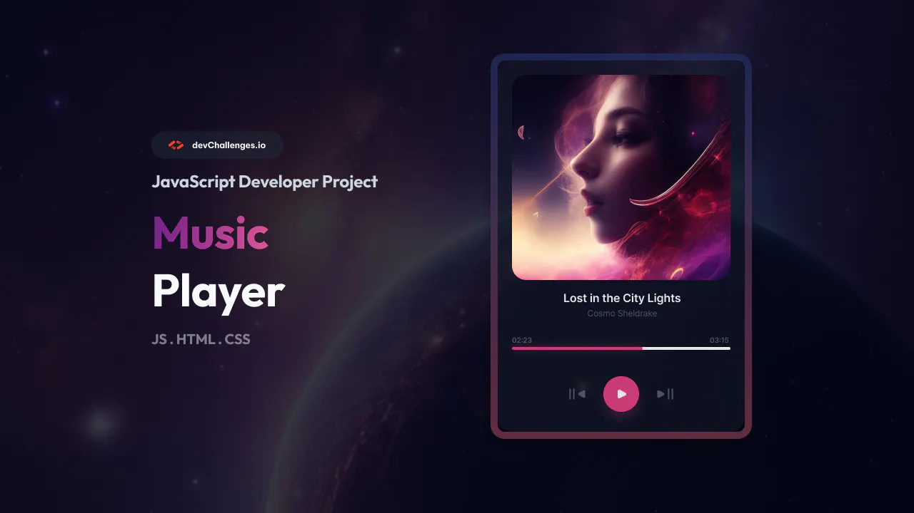

# Music Player com JavaScript Vanila

## Visão Geral do Desafio
Este projeto é um player de música simples e eficiente criado totalmente com JavaScript Vanila, HTML e CSS. O desafio foi proposto pelo site [devchallenges.io](https://devchallenges.io), com o objetivo de desenvolver um player de música limpo e funcional utilizando JavaScript puro. Além disso, aproveitei a oportunidade para aplicar meus estudos de modularização e de Factory Function, buscando manter o código mais organizado e legível.

## Recursos
- **Reproduzir, Pausar, Avançar e Retroceder:** Os usuários podem facilmente controlar a reprodução de suas músicas, com funcionalidades intuitivas de reprodução, pausa, avanço e retrocesso.
- **Progresso da Música:** Uma barra de progresso exibe a posição atual da música em reprodução. Além disso, a barra é interativa, permitindo que o usuário clique nela para selecionar um ponto específico na música.

## Organização do Código
O código é estruturado usando o padrão de módulos, tornando-o fácil de entender, estender e manter. Cada componente funcional, como os elementos, os eventos, o controle da música (desde a personalização do nome até o controle da barra de progresso), e a lista de músicas, foram modularizados. Isso promove um código limpo e mais legível.

### Estrutura de Arquivos
- **index.html:** O arquivo HTML principal contendo a estrutura da interface do player de música.
- **style.css:** O arquivo CSS responsável por estilizar os componentes do player e garantir um layout visualmente atraente.
- **Pasta js:** Onde contém os arquivos do módulo:
  - **elements.js:** Contém as variáveis de todos os elementos capturados com `querySelector`.
  - **events.js:** Contém todos os eventos de clique.
  - **musicControls.js:** Controla todos os processos relacionados às músicas, incluindo as funções de reprodução e pausa, personalização do link da música, da capa exibida, do título da música e do compositor, além do controle da barra de progresso e do timer.
  - **playlist.js:** Armazena as músicas em um array com vários objetos, cada um contendo nome, compositor, capa e link da música.
  - **main.js:** Arquivo principal que distribui todos os dados dos outros arquivos.

Gostei bastante de desenvolver este projeto, pois pude aplicar diversos conceitos que aprendi durante as últimas semanas de estudo, conceitos de HTML, CSS e principalmente JavaScript.

## Uso
Para integrar este player de música ao seu projeto, siga estas etapas simples:

1. **Clonar o Repositório:**
git clone https://github.com/gabsiq73/music-player.git

2. **Incluir Arquivos:**
- Copie os arquivos `index.html`, `style.css` e a pasta `js` para o diretório do seu projeto.

3. **Link de Dependências:**
- Certifique-se de incluir as dependências necessárias em seu arquivo HTML.
  ```html
  <link rel="stylesheet" href="style.css">
  <script src="js/main.js" defer></script>
  ```

4. **Customização:**
- Personalize a aparência do player modificando os estilos no arquivo `style.css`.
- Estenda ou modifique a funcionalidade atualizando os módulos correspondentes em `js`.


## Origem do Desafio
Este projeto foi desenvolvido como parte de um desafio no [devchallenges.io](https://devchallenges.io). O desafio específico pode ser encontrado [aqui](https://devchallenges.io/challenge/36), e foi uma oportunidade para aprimorar minhas habilidades de desenvolvimento web.


